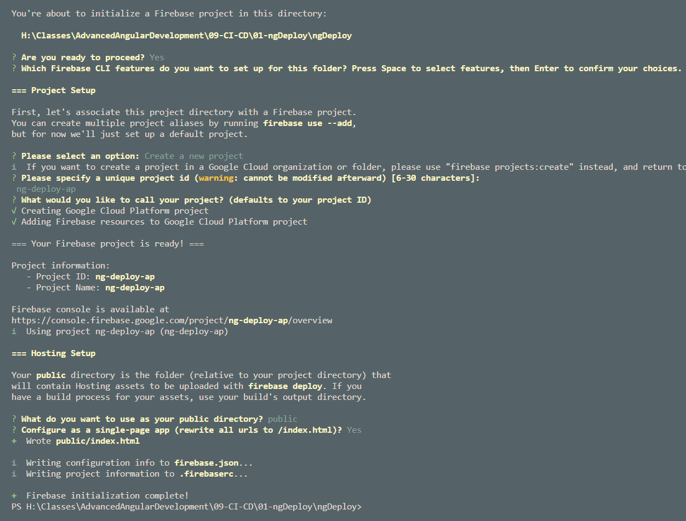
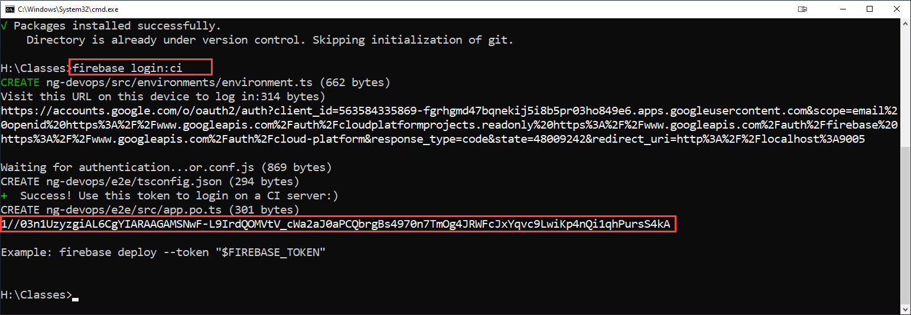
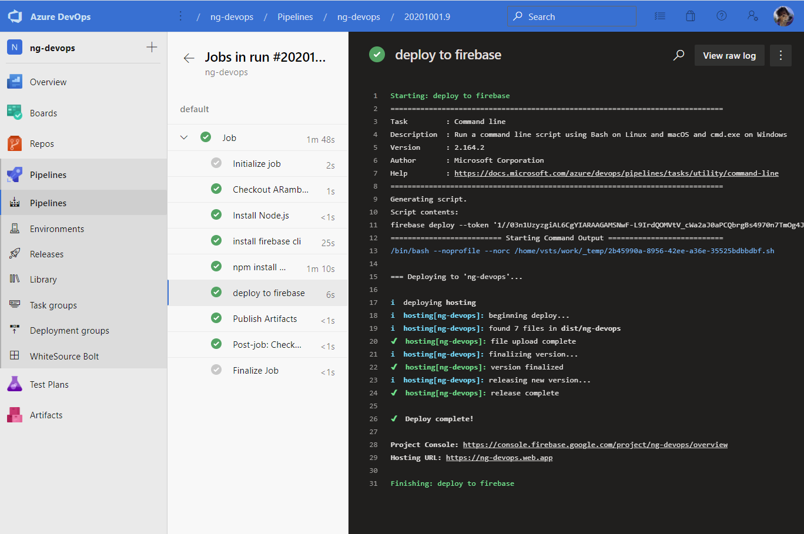

# Angular DevOps

Use [ng-devops Sample](https://github.com/ARambazamba/ng-devops)

## Firebase

[Firebase CLI Reference](https://firebase.google.com/docs/cli)

Install firebase cli:

```
npm install -g firebase-tools
```

Create a project & app

```
firebase login
```



List Projects:

```
firebase projects:list
```

Get Firebase CI Token:

```
firebase login:ci
```

Copy the token:



## Using Azure DevOps

Create a `azure-pipelines.yml` and copy the following conten:

```yml
trigger:
  branches:
    include:
      - master

variables:
  name: fbtoken
  value: "1//03n1UzyzgiAL6CgYIARAAGAMSNwF-L9IrdQOMVtV_cWa2aJ0aPCQbrgBs4970n7TmOg4JRWFcJxYqvc9LwiKp4nQi1qhPursS4kA"

stages:
  - stage: default

    jobs:
      - job: Job
        pool:
          vmImage: "ubuntu-latest"

        steps:
          - task: NodeTool@0
            inputs:
              versionSpec: "12.x"
            displayName: "Install Node.js"

          - script: |
              npm install -g firebase-tools
            displayName: "install firebase cli"

          - script: |
              npm install -g @angular/cli
              npm install
              ng build --prod
            displayName: "npm install and build"

          - script: |
              firebase deploy --token $TOKEN
            env:
              TOKEN: $(fbtoken)
            displayName: "deploy to firebase"

          - task: PublishBuildArtifacts@1
            inputs:
              PathtoPublish: "dist/ng-devops"
              ArtifactName: "ngapp"
              publishLocation: "Container"
            displayName: "Publish Artifacts"
```

> Note: In real life you would get the token from a Key Vault and access it using a variable

Run & Check the pipeline:



## Using GitHub Actions
