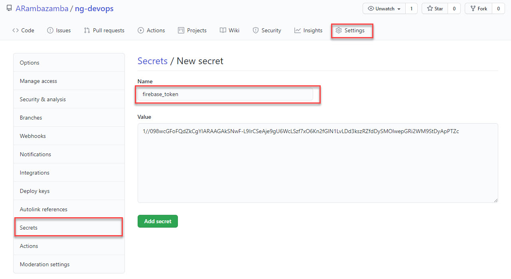

# Angular DevOps

Use [ng-devops Sample](https://github.com/ARambazamba/ng-devops)

## Setup Firebase Hosting

[Firebase CLI Reference](https://firebase.google.com/docs/cli)

Install firebase cli:

```
npm install -g firebase-tools
```

Create a project & app

```
firebase login
```

Initialize Project using `firebase init`:


Your config is saved to this files:

`.firebaserc`:

```json
{
  "projects": {
    "default": "ng-devops"
  }
}
```

`firebase.json`:

```json
{
  "hosting": {
    "public": "dist/ng-devops",
    "ignore": ["firebase.json", "**/.*", "**/node_modules/**"],
    "rewrites": [
      {
        "source": "**",
        "destination": "/index.html"
      }
    ]
  }
}
```

List Projects:

```
firebase projects:list
```

Switch the Firebase Project:

```
firebase use ng-devops-4589a
```

Deploy manually:

```
ng build --prod
firebase deploy
```

Get Firebase CI Token:

```
firebase login:ci
```

Copy the token:


## Using Azure DevOps

Create a `azure-pipelines.yml` and copy the following conten:

```yml
trigger:
  branches:
    include:
      - master

variables:
  name: fbtoken
  value: "1//03n1UzyzgiAL6CgYIARAAGAMSNwF-L9IrdQOMVtV_cWa2aJ0aPCQbrgBs4970n7TmOg4JRWFcJxYqvc9LwiKp4nQi1qhPursS4kA"

stages:
  - stage: default

    jobs:
      - job: Job
        pool:
          vmImage: "ubuntu-latest"

        steps:
          - task: NodeTool@0
            inputs:
              versionSpec: "12.x"
            displayName: "Install Node.js"

          - script: |
              npm install -g firebase-tools
            displayName: "install firebase cli"

          - script: |
              npm install -g @angular/cli
              npm install
              ng build --prod
            displayName: "npm install and build"

          - script: |
              firebase deploy --token $TOKEN
            env:
              TOKEN: $(fbtoken)
            displayName: "deploy to firebase"

          - task: PublishBuildArtifacts@1
            inputs:
              PathtoPublish: "dist/ng-devops"
              ArtifactName: "ngapp"
              publishLocation: "Container"
            displayName: "Publish Artifacts"
```

> Note: In real life you would get the token from a Key Vault and access it using a variable

Run & Check the pipeline:


## Using GitHub Actions

[About GitHub Actions](https://help.github.com/en/articles/about-github-actions)

[Workflow syntax for GitHub Actions](https://help.github.com/en/articles/workflow-syntax-for-github-actions)

Persist the Firebase Token that you have claimed previously:



Create a `main.yml` at `.github/workflows/`

Add the yaml:

```yaml
name: Angular Simple CI-CD

on: [push]

jobs:
  build:
    runs-on: ubuntu-20.04

    steps:
      - uses: actions/checkout@v1

      - name: Use Node.js 12.8
        uses: actions/setup-node@v1
        with:
          node-version: 12.8

      - name: Install Firebase CLI
        run: npm install -g firebase-tools

      - name: Install dependencies
        run: npm install

      - name: Build Angular
        run: npm run build -- --prod

      - name: Deploy to Firebase
        run: firebase deploy --token ${{ secrets.firebase_token }}
        env:
          CI: true
          FIREBASE_TOKEN: ${{ secrets.firebase_token }}
```

That's it!

!
